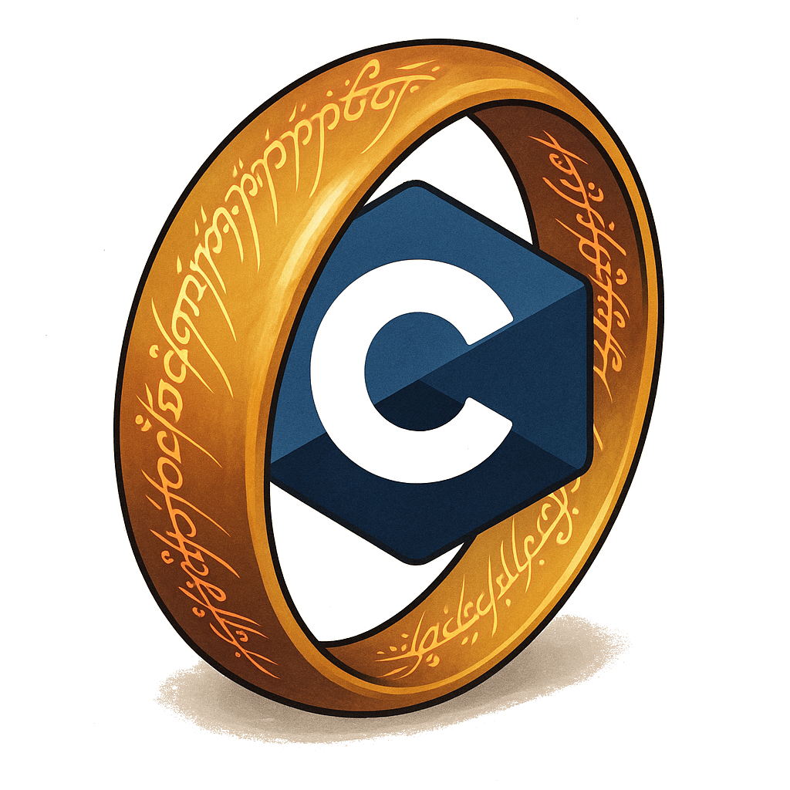

<p align="center">
    <h1>Octra</h1>
</p>

<p align="center">
  
</p>

<p align="center">
<blockquote style="text-align: center;">
  One C to rule them all, one C to find them, one C to bring them all and in the darkness...
</blockquote>
</p>

---

Octra is a C/C++ project that has (nearly) automatically generated bindings for a
variety of languages, including Python, R, JavaScript, Lua, PHP, Java, C#, D
and Go. It is merely meant to be used as a kickstart template for similar
projects that need to provide bindings to multiple languages. As such, it is
permissively licensed under the Unlicense.

It uses CMake as the build system, and Just as a task runner. The project
maintains a nix flake for easy development and testing.

To demonstrate nontrivial examples, it provides simple implementations of some
common datastructures (e.g. dynamic array) written in C and bound to all
targeted binding languages. It is meant to be installable from any of the
supported languages' package managers (e.g. PyPI for Python, CRAN for R, npm
for JavaScript, etc). Thus, it also provides build configurations for these
package managers along with necessary packaging files for each language. While
this makes the project more complex, it also means that there is a single source
of truth for the core implementation, and that any bug fixes or improvements
can be made in one place and propagated to all bindings.

## 🚗 Test drive

### ❄️ NixOS

The easiest way to test drive the project is to use the provided Nix flake. You can
use the following command to enter a development shell with all dependencies:

```bash
nix develop
```

To build the project

```bash
just build
```

to run tests:

```bash
just test
```

to build examples:

```bash
just examples
```

to run TARGET example:

```bash
just run TARGET=example_name
```

## Renaming this template

This repo is intended to be cloned and renamed. All occurrences of the project name are expected to be `octra` (lowercase) unless casing is required by a particular ecosystem.

- Rename everything (file contents + paths): `./rename_octra <new_project_name>`
  - `<new_project_name>` must be lowercase (a-z, 0-9, `_` or `-`)

## Bindings

### Test Drive

#### Python

```bash
just python
```

#### R

```bash
just build-r
just install-r
just r
```

#### Javascript

```bash
just js
just js-repl
```

#### Lua

```bash
just run-lua
just repl-lua
just test-lua
```

#### Rust

```bash
just run-rust
just repl-rust
just test-rust
```

## Bindings

Binding support is (to be) provided for the following languages:

| Language   | Name          | Implemented |
| ---------- | --------------| ----------- |
| C#         | OctraDotNet   | ✅          |
| D          | DOctra        | ✅          |
| Go         | Gooctra       | ✅          |
| Guile      | OctraGuile    | ✅          |
| Java       | Joctra        | ✅          |
| Javascript | OctraJS       | ✅          |
| Lua        | Loctra        | ✅          |
| OCaml      | OctraML       | ✅          |
| Octave     | MOctra        | ✅          |
| PHP        | OctraPHP      | ✅          |
| Perl       | Poctra        | ✅          |
| Python     | PyOctra       | ✅          |
| R          | OctraR        | ✅          |
| Ruby       | RbOctra       | ✅          |
| Rust       | RustOctra     | ✅          |
| Tcl/TK     | OctraTK       | ✅          |

Each binding lives under `src/` (e.g. `src/rustoctra/`, `src/gooctra/`, `src/octruby/`),
with SWIG generator inputs kept alongside each binding (typically `src/<binding>/swig/`).
The C/C++ core remains the single
source of truth; bindings are (re)generated via the `just prebuild-*` /
`just build-*` workflows.
