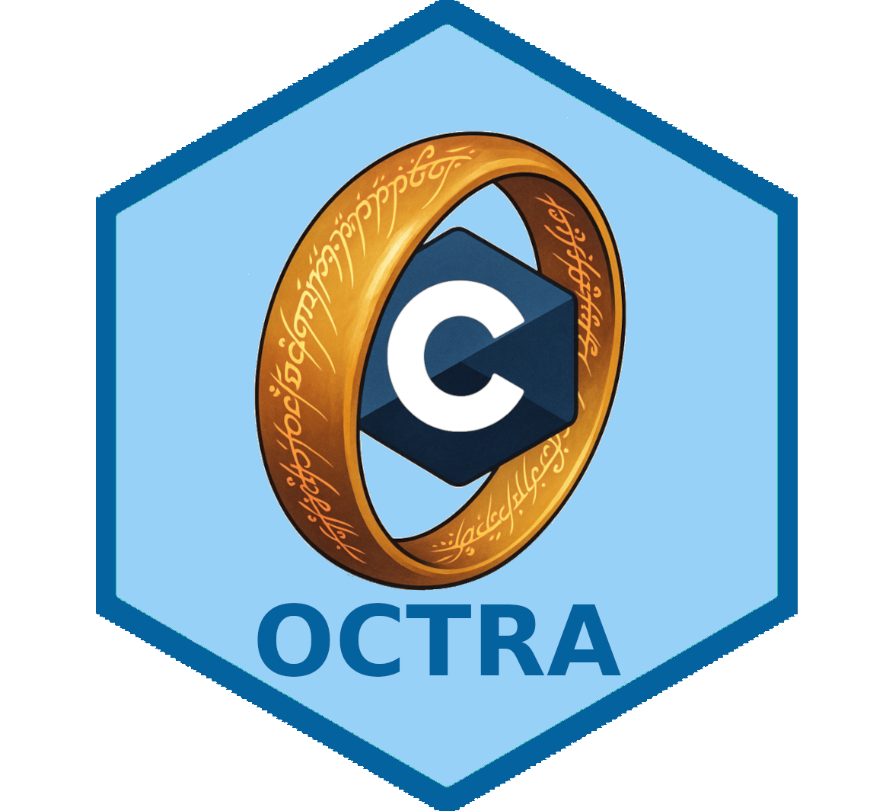

# Octra

<div style="text-align: center;">
  
</div>

<blockquote style="text-align: center;">
  One C to rule them all, one C to find them, one C to bring them all and in the darkness...
</blockquote>

---


Octra is a C library that is bound variety of languages, including Python, R,
and JavaScript. It is meant to be used as a template for similar projects that
need to provide bindings to multiple languages. As such, it is permissively
licensed under the Unlicense.


## :bluecar: Test drive (nixos)

To build the project

```bash
just build
```

to run tests:

```bash
just test
```

to build examples:

```bash
just examples
```

to run TARGET example:

```bash
just run TARGET=example_name
```

## Bindings


### Test Drive


#### Python

```bash
just py
just py-repl
```

#### R

```bash
just r
just r-repl
```

#### Javascript

```bash
just js
just js-repl
```

